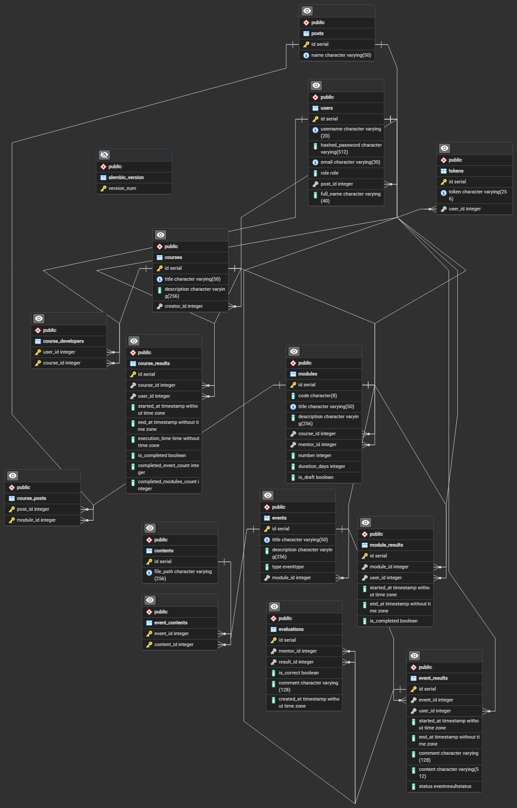

# Установка и настройка проекта

## 1. Создание виртуального окружения

Для начала создайте виртуальное окружение. Выполните следующую команду в корневой папке проекта:

```bash
python -m venv .venv
```

Дальше активируйте venv
```bash
.venv/Scripts/Activate
```

Установите зависимости
```bash
pip install -r requirements.txt
```

Примените миграции
```bash
alembic upgrade head
```

## 2. Создание виртуального окружения

Создайте файл .env и заполните его данными из test.env
```env
DB_USER=Имя пользователя
DB_PASSWORD=Пароль пользователя
DB_NAME=Имя БД

SECRET_KEY=Секретный ключ для хеширования
```

# ERD Схема



